<!-- jd://signal  cmVhZGluZyB0aGUgc291cmNlPyBnb29kIGluc3RpbmN0LiB0aGlzIHJlcG8gaXMgdGhlIHNpdGUsIGFuZCBzaXggZmxhZ3MgYXJlIGhpZGRlbiBhY3Jvc3MgaXQuIHRoZSBodW50IHN0YXJ0cyBpbiB0aGUgbGFiOiBodHRwczovL2phbml0aC5xenouaW8vbGFiLmh0bWw= -->

<div align="center">

<a href="https://janith.qzz.io"></a>

<a href="https://janith.qzz.io"></a>&nbsp;
<a href="https://janith.qzz.io/lab.html"></a>&nbsp;
<a href="mailto:janithmihijaya123@gmail.com"></a>

<a href="https://github.com/janiyax35/janiyax35.github.io/actions/workflows/static.yml"></a>


</div>

<details>
<summary><b>tl;dr</b>: the 20-second plain-text version</summary>
<br>

- **What:** the source of my portfolio, [janith.qzz.io](https://janith.qzz.io): a cybersecurity portfolio styled as an operator console, plus The Lab, a small cyber range with a six-flag CTF.
- **Built by:** me, Janith Deshan, a Cybersecurity undergraduate at SLIIT. Design, code and content.
- **Stack:** plain HTML, CSS and JavaScript; GSAP, Lenis, xterm.js, EmailJS and three.js (404 page only) from pinned CDNs with SRI. No framework, no build step.
- **Hosting:** GitHub Pages, deployed by GitHub Actions, on a custom domain.
- **Run it:** `python -m http.server 5500`, then open http://localhost:5500

</details>

<br>

<picture><source media="(prefers-color-scheme: light)" srcset=".github/readme/assets/head-overview-light.svg"></picture>

This is my portfolio, built to feel like the tools I work with: a dark operator console with one lime accent, a real terminal, and projects written up as case files.

It has two pages:

- **Home** (`index.html`) is only about me and my work: who I am, my skills, nine case files, my research, education and certifications, and a contact form.
- **The Lab** (`lab.html`) holds the extras: a six-flag CTF, a full-size shell, a threat globe, and a self-audit of how the site is secured.

Everything is hand-written HTML, CSS and JavaScript. All content lives in one file (`js/data.js`) and is rendered in the browser.

<table>
<tr>
<td width="50%"><a href="https://janith.qzz.io">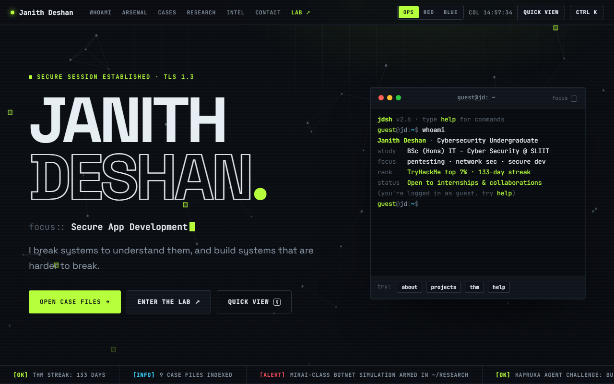</a></td>
<td width="50%"><a href="https://janith.qzz.io/lab.html">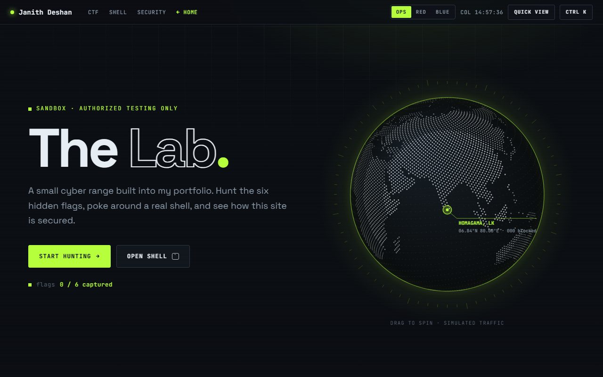</a></td>
</tr>
<tr>
<td align="center"><sub>home · <code>index.html</code></sub></td>
<td align="center"><sub>the lab · <code>lab.html</code></sub></td>
</tr>
</table>

<picture><source media="(prefers-color-scheme: light)" srcset=".github/readme/assets/head-features-light.svg"></picture>

<p align="center">
</p>


Keyboard: <kbd>Ctrl</kbd> + <kbd>K</kbd> or <kbd>/</kbd> opens the command palette, <kbd>Q</kbd> the quick view, <kbd>`</kbd> the terminal. <kbd>Shift</kbd> + right-click brings back the browser's own menu.

<picture><source media="(prefers-color-scheme: light)" srcset=".github/readme/assets/head-architecture-light.svg"></picture>


<picture><source media="(prefers-color-scheme: light)" srcset=".github/readme/assets/head-stack-light.svg"></picture>


<picture><source media="(prefers-color-scheme: light)" srcset=".github/readme/assets/head-security-light.svg"></picture>

A security portfolio should be secure itself. GitHub Pages can't set response headers, so everything that can be done in the page is done in the page. The live self-audit is at [lab.html#security](https://janith.qzz.io/lab.html#security).

| Control | Where | What it stops |
|---|---|---|
| Content-Security-Policy (`<meta>`) | `index.html`, `lab.html`, `404.html` | Scripts from anywhere except the site and three pinned CDNs, plus plugins, embedded frames and `<base>` hijacking. Each page allows only the network hosts it needs. |
| Subresource Integrity (SHA-384) | every CDN `<script>` and stylesheet | A compromised or tampered CDN file: the browser refuses to run it |
| Hash-checked data fetch | globe data in `js/fx.js` | Tampered map data from the CDN |
| CTF flags stored as SHA-256 hashes | `js/ctf.js` | Reading the answers straight out of the source |
| Contact-form spam controls | `js/main.js` | Bots: honeypot field, 3-second time trap, 30-second cooldown, EmailJS rate limit and headless-browser blocking |
| No analytics or trackers | whole site | Tracking visitors; there are no third-party cookies |
| `security.txt` (RFC 9116) | `/.well-known/security.txt` | Gives researchers a clear way to report a real issue |

Found a real vulnerability (not a CTF flag)? Please email me privately first: [janithmihijaya123@gmail.com](mailto:janithmihijaya123@gmail.com).

<picture><source media="(prefers-color-scheme: light)" srcset=".github/readme/assets/head-lab-light.svg"></picture>

Six flags are hidden across the site, from easy to hard. Start at **[The Lab](https://janith.qzz.io/lab.html)**: it has the scoreboard, the hints, and a shell you can submit flags from. Your progress stays in your own browser.

Yes, this repo is the site's source, so reading it is fair game. Please don't post the answers publicly; let others enjoy the hunt.

<picture><source media="(prefers-color-scheme: light)" srcset=".github/readme/assets/head-run-light.svg"></picture>

Use a local server rather than opening `index.html` directly. The cookie challenge and some browser APIs don't work on `file://`.

```bash
git clone https://github.com/janiyax35/janiyax35.github.io.git
cd janiyax35.github.io
python -m http.server 5500
```

Then open http://localhost:5500.

| To change | Edit |
|---|---|
| All content: profile, skills, case files, education, certifications | `js/data.js` |
| Colours, fonts, layout | `css/style.css` (design tokens at the top) |
| Page structure | `index.html` (home), `lab.html` (The Lab) |
| Terminal commands | `js/terminal.js` |
| Hero network, globe, Mirai simulation, topology | `js/fx.js` |

More detail, including how to update SRI hashes and the CSP, is in [DEVELOPMENT.md](DEVELOPMENT.md). Pushing to `main` deploys the site automatically.

<picture><source media="(prefers-color-scheme: light)" srcset=".github/readme/assets/head-contact-light.svg"></picture>

Open to **internships and collaborations** in security. Email is the fastest way to reach me, and I reply within 48 hours.

[janithmihijaya123@gmail.com](mailto:janithmihijaya123@gmail.com) · [LinkedIn](https://linkedin.com/in/janithdeshan) · [janith.qzz.io](https://janith.qzz.io) · [GitHub profile](https://github.com/janiyax35)

**License:** the code is [MIT](LICENSE), so you're welcome to learn from it and reuse the techniques. My personal content (the text, CV, photos and case-file write-ups) isn't covered by that licence. Please don't publish it as your own.

<a href="https://janith.qzz.io"></a>

<p align="center"><sub>Graphics are generated by <code>.github/readme/build.mjs</code> (see <a href=".github/readme/BUILD.md">BUILD.md</a>). Part of the case files at <a href="https://janith.qzz.io/#cases">janith.qzz.io</a>. Stay curious, stay secure.</sub></p>
